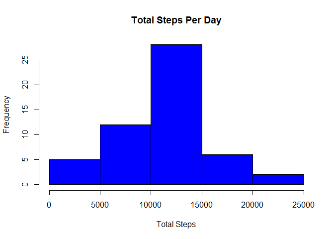
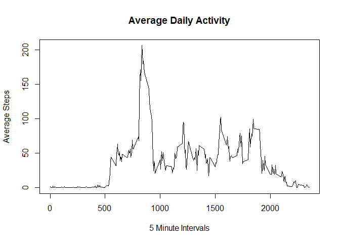
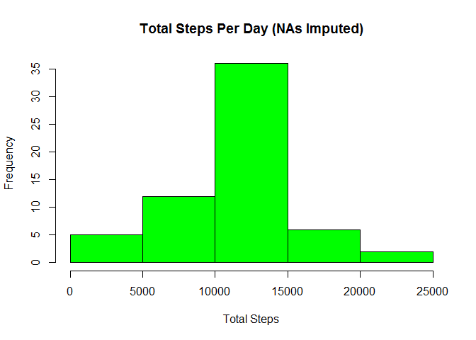
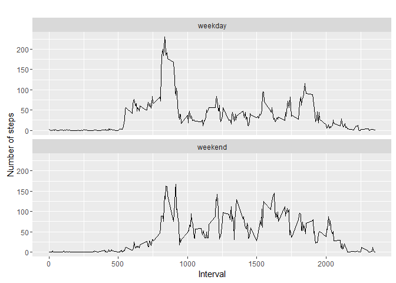

# Reproducible Research: Peer Assessment 1


## Loading and preprocessing the data

```r
library(ggplot2)

#read activity raw data file
activityData <- read.csv("activity.csv")
str(activityData)
```

```
## 'data.frame':	17568 obs. of  3 variables:
##  $ steps   : int  NA NA NA NA NA NA NA NA NA NA ...
##  $ date    : Factor w/ 61 levels "2012-10-01","2012-10-02",..: 1 1 1 1 1 1 1 1 1 1 ...
##  $ interval: int  0 5 10 15 20 25 30 35 40 45 ...
```


## What is mean total number of steps taken per day?


```r
#calculate the total number of steps taken per day (ignore missing values)
stepsPerDay <- aggregate(steps ~ date, activityData, sum)

#plot histograme of total steps per day
hist(stepsPerDay$steps, xlab = "Total Steps", main = "Total Steps Per Day", col ="blue")
```

\

```r
#determine the mean and median of total steps per day
mean(stepsPerDay$steps)
```

```
## [1] 10766.19
```

```r
median(stepsPerDay$steps)
```

```
## [1] 10765
```


## What is the average daily activity pattern?


```r
# 1. Make a time series plot (i.e. type = "l") of the 5-minute interval (x-axis) 
#    and the average number of steps taken, averaged across all days (y-axis)
# determine the 
stepsPerInterval <- aggregate(steps ~ interval, activityData, mean)
plot(stepsPerInterval$interval,stepsPerInterval$steps, 
     type="l",
     xlab = "5 Minute Intervals",
     ylab = "Average Steps",
     main = "Average Daily Activity")
```

\

```r
# Which 5 minute interval contains the max number of steps
stepsPerInterval[stepsPerInterval$steps == max(stepsPerInterval$steps), ]
```

```
##     interval    steps
## 104      835 206.1698
```


## Imputing missing values

```r
# 1. Calculate and report the total number of missing values in the dataset 
#    (i.e. the total number of rows with NAs)
sum(is.na(activityData$steps))
```

```
## [1] 2304
```

```r
# 2. Devise a strategy for filling in all of the missing values in the dataset. The strategy does not need to be sophisticated. 
#    For example, you could use the mean/median for that day, or the mean for that 5-minute interval, etc.

#     Strategy: We will replace NA's with the average number of steps for that interval from the stepsPerInterval table previously created

# 3. Create a new dataset that is equal to the original dataset but with the missing data filled in.
activityImputed <- activityData
for(i in 1 : nrow(activityImputed)){
  if(is.na(activityImputed$steps[i])){
    activityImputed$steps[i] <- stepsPerInterval$steps[stepsPerInterval$interval == activityImputed$interval[i]]
  }
}

# 4. Make a histogram of the total number of steps taken each day and Calculate and 
#    report the mean and median total number of steps taken per day.
stepsPerDayImputed <- aggregate(steps ~ date, activityImputed, sum)

#plot histograme of total steps per day
hist(stepsPerDayImputed$steps, xlab = "Total Steps", main = "Total Steps Per Day (NAs Imputed)", col ="green")
```

\

```r
# report on mean and median
print("New Imputed Mean and Median:")
```

```
## [1] "New Imputed Mean and Median:"
```

```r
mean(stepsPerDayImputed$steps)
```

```
## [1] 10766.19
```

```r
median(stepsPerDayImputed$steps)
```

```
## [1] 10766.19
```

```r
#re-show the original mean and median
print("Original Mean and Median:")
```

```
## [1] "Original Mean and Median:"
```

```r
mean(stepsPerDay$steps)
```

```
## [1] 10766.19
```

```r
median(stepsPerDay$steps)
```

```
## [1] 10765
```
Do these values differ from the estimates from the first part of the assignment? 

```
## [1] "There is a slight change in median, while the mean remains the same"
```

What is the impact of imputing missing data on the estimates of the total daily number of steps?


```
## [1] "Overall, there is only a slight difference and there should be limited impact to our overall analysis"
```


## Are there differences in activity patterns between weekdays and weekends?

```r
# 1. Create a new factor variable in the dataset with two levels - "weekday" and "weekend" 
#    indicating whether a given date is a weekday or weekend day. use new imputed dataset.

# identify Day of Week for each date
activityImputed$DOW <- format(as.POSIXlt(activityImputed$date), "%A")
# set if weekday or weekend category and make a factor
for(i in 1:nrow(activityImputed)){
  if(activityImputed$DOW[i] %in% c("Saturday","Sunday")){
    activityImputed$DOW[i] <- "weekend"
  }
  else {
    activityImputed$DOW[i] <- "weekday"
  }
}

# make DOW a factor
activityImputed$DOW <- as.factor(activityImputed$DOW)

# 2. Make a panel plot containing a time series plot (i.e. type = "l") of the 5-minute interval (x-axis) 
#    and the average number of steps taken, averaged across all weekday days or weekend days (y-axis). 

#aggregate steps
stepsImputedAgg <- aggregate(steps ~ interval+DOW, activityImputed, mean)


qplot(interval, steps, data=stepsImputedAgg, geom=c("line"), xlab="Interval", 
      ylab="Number of steps", main="") + facet_wrap(~ DOW, ncol=1)
```

\

